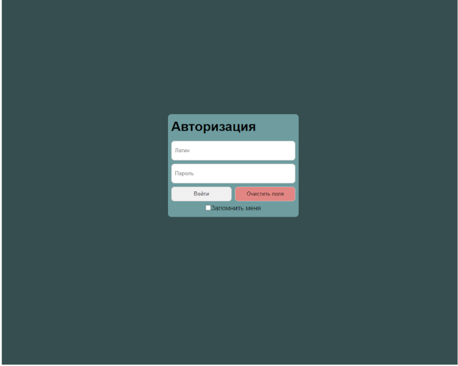
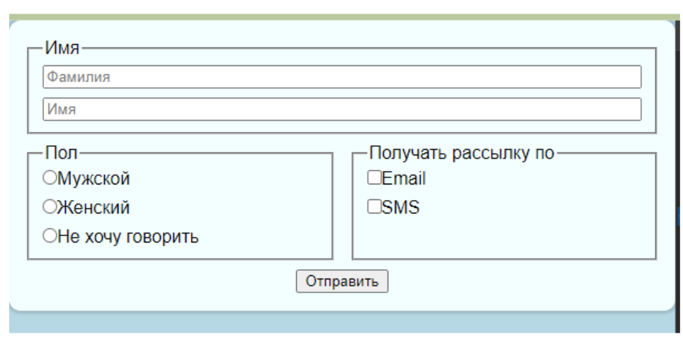
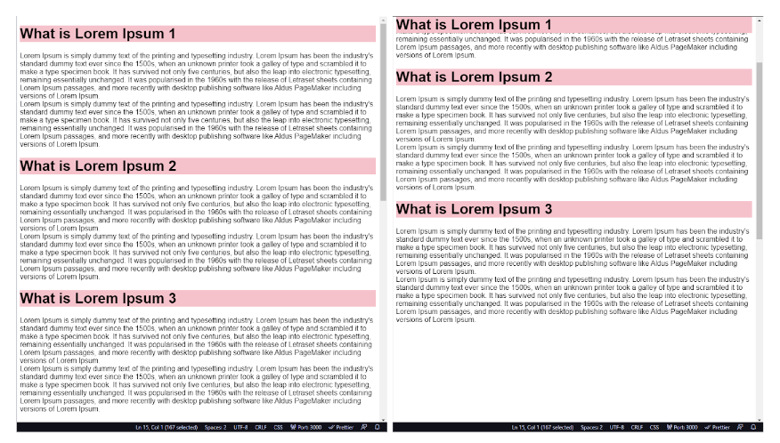
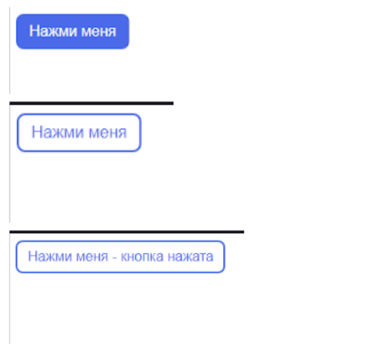
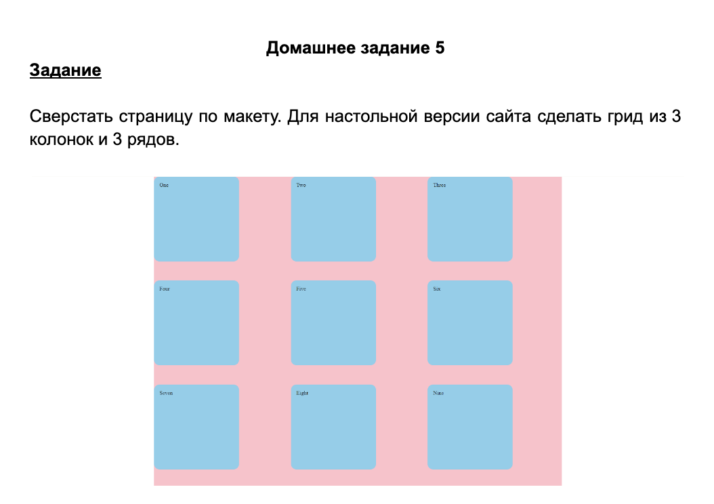

# HTML, CSS, JavaScript

## homework_01

1. Создать папку проекта с название HW на рабочем столе.
2. В папке создать файл index.html
3. В файл index.html добавить простейшую html страницу с тегами html, head, body и h1.
4. В теге h1 прописать текст “This is my first homework!”
5. Запустить программу.

## homework_01_1

1. Создать папку на рабочем столе
2. Создать два файла index.html и style.css
3. Добавить в файл HTML базовую разметку
4. Подключить CSS к HTML
5. Сверстать страницу по [макету](https://www.figma.com/design/e79zBwkdWlkVf29zoHjdVa/Task1?node-id=0-1&p=f&t=bSlGwP512LHFS0Kt-0)

## homework_02

Создайте маркированный список продуктов.

1. Создать папку проекта с название HW2 на рабочем столе.
2. В папке создать файл index.html
3. В файл **index.html** добавить базовую html разметку
4. Добавить маркированный список **ul**
5. В список добавить 5 элементов **li**, каждый из которых должен хранить название продукта.
6. Каждый элемент списка должен иметь разный цвет бэкграунда.

## homework_02_1

Сверстать страницу по макету:

Форма должна содержать 2 текстовых поля (text, password), 2 кнопки (отправка данных и сброс), 1 чекбокс.

## homework_03

1. Создайте HTML-страницу с контейнером(div) для списка карточек(div).
2. Используя CSS и свойства Flexbox, сделайте так, чтобы карточки располагались в строку и растягивались по ширине контейнера. Можно использовать любое кол-во карточек.
3. Каждая карточка должна содержать изображение(любое изображение) и название (любой текст).
4. Убедитесь, что при уменьшении размеров экрана карточки остаются читаемыми и красиво адаптируются.

## homework_03_1

Сверстать форму по образцу, использовать flex-direction: column для формы, и flex для блока с двумя fieldset, кнопку отправки центрировать с помощью flex. Наполнение и цвета могут быть произвольными.

## homework_04

Создать HTML-страницу, которая содержит 3 блока с заголовком и текстом, заголовок должен “прилипать” к верхней части страницы при прокрутке. Тегу body задать высоту в 2000px. Наполнение блоков произвольное, можно воспользоваться сайтом https://www.lipsum.com/.

Должно получиться:

## homework_04_1

Создать HTML-страницу, которая содержит кнопку. Кнопку стилизовать на свое усмотрение, можно опираться на скриншоты.
Кнопка должна иметь 3 состояния:

- покой - основные стили
- наведение - можно изменить цвет текста, фон, границу и т.д.
- нажатие - должен появляться текст “Кнопка нажата”
  Для смены состояний использовать анимированный переход.

## homework_05

## homework_05_1

Сверстать 3 экран макета из прошлых уроков.

[Макет](https://www.figma.com/file/siI1IXw74fX9Q5c4NqJHPn/Untitled?type=design&node-id=0%3A1&mode=design&t=MiyGFGUF5xBDKgJI-1)

## homework_06

В макет из прошлого задания (4 экран) добавить в боковое меню произвольные иконки (bootstrap icons, fontawesome, material symbols/icons).

[Макет](https://www.figma.com/file/siI1IXw74fX9Q5c4NqJHPn/Untitled?type=design&node-id=0%3A1&mode=design&t=MiyGFGUF5xBDKgJI-1)

## homework_06_1

### Задание 1. 

- Объявите две переменные firstName и lastName и присвойте им ваши имя и фамилию.
- С помощью конкатенации строк создайте третью переменную greeting, содержащую приветствие в формате "Привет, Имя Фамилия!".
- Выведите переменную greeting в консоль.

### Задание 2.*

- Создайте переменную sentencePart1 и присвойте ей начало предложения (например, "Я люблю").
- Создайте переменную sentencePart2 и присвойте ей завершение предложения (например, "программирование").
- С помощью конкатенации строк создайте переменную completeSentence, объединяющую обе части предложения.
- Выведите переменную completeSentence в консоль.

## homework_06_2

### Задание 1.*

Напишите программу для оценки студентов в зависимости от их баллов. Программа должна принимать на вход количество баллов (целое число) и выводить оценку в виде буквенного символа по следующей шкале:
- 90 и выше: 'A'
- 80-89: 'B'
- 70-79: 'C'
- 60-69: 'D'
- Меньше 60: 'F'

### Задание 2.*

- Объявите переменную dayOfWeek и присвойте ей значение от 1 до 7, представляющее день недели (например, 1 - "Понедельник", 2 - "Вторник", и так далее).
- Используя конструкцию switch, определите текущий день недели и выведите его в консоль. (Попробуйте поменять значение переменной dayOfWeek и запустить программу снова.)

## homework_07

1) Создайте массив чисел и выведите значения массива в консоль. (Используйте цикл).
2) Создайте массив произвольных чисел(от 2 до 24) и выведите все числа, которые меньше 20, но больше 8. (Используйте цикл).
const arr = [4, 2, 8, 6, 12, 5, 21, 24, 20, 22, 8, 7, 6, 9]
3) Создайте массив чисел и найдите минимальное значение.
4) Создайте массив чисел и обновите значение элемента по индексу. 
5) Создайте массив слов. Найдите самое длинное слово в массиве. (У строк, также как и у массивов, есть свойство length, которое измеряет длину строки).

## homework_07_1

### Задание 1
Создайте объект, представляющий человека, с полями "имя" и "возраст". Выведите информацию о человеке в консоль.

### Задание 2
Создайте объект, представляющий книгу, с полями "название" и "автор". Создайте массив объектов книг и выведите информацию о каждой книге в консоль.

### Задание 3 *
Дан объект, который олицетворяет собой прямоугольник и длины его сторон const rectangle = { a: 10, b: 35 }. Добавьте в этот объект ключи s  и p, в s должна быть вычислена площадь прямоугольника, а в p его периметр.

### Задание 4 *
Создайте массив объектов, представляющих различные фрукты. Используйте цикл для фильтрации только тех фруктов, которые имеют цвет "красный", и выведите их в консоль.

### Задание 5 **
Создайте объект `playlist` с песнями в виде массива объектов. Выведите информацию о каждой песне в консоль

## homework_08

### Задание 1
Создайте функцию, которая принимает два числа в качестве параметров и возвращает их сумму, для второго параметра определите значение по умолчанию. Затем вызовите функцию и выведите результат в консоль.

### Задание 2
Создайте массив numbers с несколькими числами.
Напишите функцию calculateSum, которая принимает массив и возвращает сумму всех его элементов, не используя методы массивов.

### Задание 3 *
Создайте массив students с объектами студентов (имя, возраст, курс).
Напишите функцию displayStudentInfo, которая принимает студента и выводит его информацию в консоль.

## homework_08_1

### Задание 1
Создайте функцию, которая принимает массив чисел в качестве параметра и возвращает произведение всех элементов массива. Затем вызовите функцию и выведите результат в консоль.

### Задание 2
Сумма элементов массива: Создайте массив чисел. Напишите код, который использует цикл while для подсчета суммы всех элементов массива.

