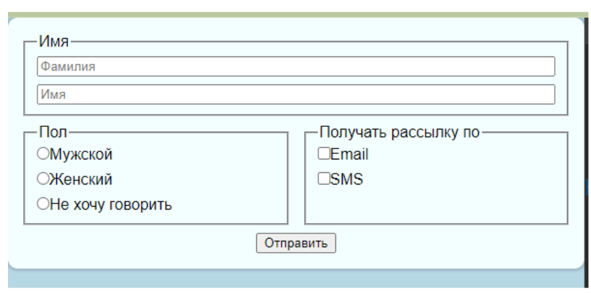

## HTML, CSS, JavaScript: домашнее задание 3.1

Сверстать форму по образцу, использовать flex-direction: column для формы, и flex для блока с двумя fieldset, кнопку отправки центрировать с помощью flex. Наполнение и цвета могут быть произвольными.

