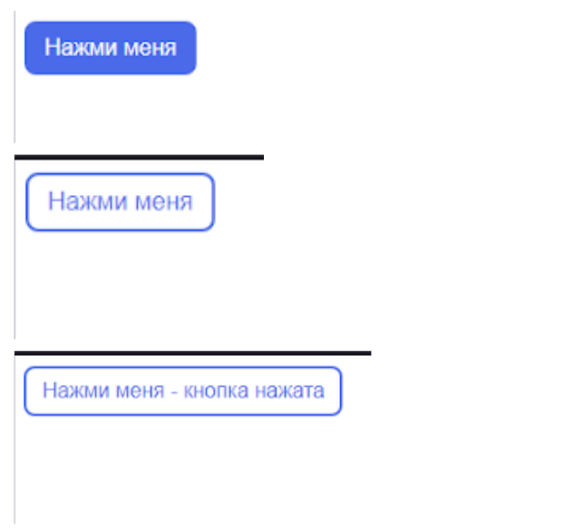

## HTML, CSS, JavaScript: домашнее задание 4.1

Создать HTML-страницу, которая содержит кнопку. Кнопку стилизовать на свое усмотрение, можно опираться на скриншоты.
Кнопка должна иметь 3 состояния:
- покой - основные стили
- наведение - можно изменить цвет текста, фон, границу и т.д.
- нажатие - должен появляться текст “Кнопка нажата”
Для смены состояний использовать анимированный переход.

